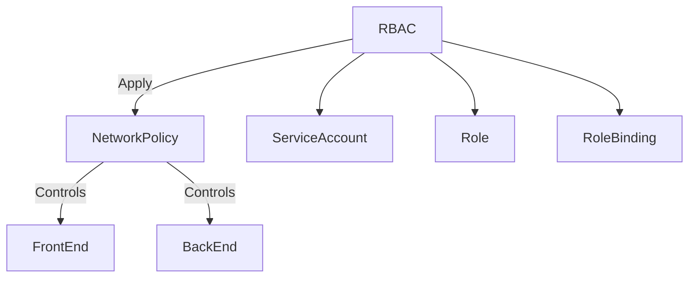

todo > add the goal to reach from front end to backend with the service account on top of the arrow

## 🚀 Reach Active Policy

1. **RBAC**
    - `kubectl apply -f serviceaccount.yaml` 📄
    - `kubectl apply -f role.yaml` 📄
    - `kubectl apply -f rolebinding.yaml` 📄
2. **NetworkPolicy Testing** (Front to BackEnd)
- kubectl auth can-i get pods --as=system:serviceaccount:default:dev-user >>> more likely to be automated.

>>> also See it with manual wget as well >>> closer to prototype situation >>> port and service usage!

Cluster Wide Policy Versus Pod Wide is Different